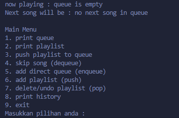

# 🎵 Music Queue & Playlist Manager 🎵

Hey! Selamat datang di aplikasi pengelola antrian musik saya. Program ini dibuat sebagai implementasi struktur data Stack dan Queue dalam bahasa C. Keren kan? 😎

## ✨ Fitur-fitur

Program ini punya beberapa fitur seru yang bisa kamu coba:

1. **Lihat Queue** - Cek lagu apa aja yang ada di antrean pemutaran
2. **Lihat Playlist** - Cek koleksi lagu yang sudah kamu simpan
3. **Pindahkan Playlist ke Queue** - Pindahkan semua lagu dari playlist ke antrean pemutaran
4. **Skip Lagu** - Lewati lagu yang sedang diputar (dequeue)
5. **Tambah Lagu ke Queue** - Tambah lagu langsung ke antrean
6. **Tambah Lagu ke Playlist** - Simpan lagu baru ke koleksi playlist
7. **Hapus/Undo dari Playlist** - Hapus lagu terakhir dari playlist
8. **Lihat Riwayat** - Cek lagu-lagu yang sudah diputar sebelumnya
9. **Keluar** - Tutup aplikasi dan bersihkan memori

## 📸 Screenshot Program



## 🚀 Cara Menggunakan

1. Compile program dengan command:

   ```
   gcc -o music_player main.c linked.c queue.c stack.c print.c
   ```
2. Jalankan program:

   ```
   ./music_player
   ```
3. Ikuti menu yang tersedia dengan mengetik angka 1-9 sesuai fitur yang ingin digunakan

## 🔍 Implementasi

Program ini menggunakan:

- **Linked List** sebagai struktur data dasar
- **Queue** untuk mengelola antrian pemutaran musik
- **Stack** untuk mengelola playlist dan riwayat

Semua diimplementasikan dalam bahasa C dengan alokasi memori dinamis.

## 🔧 Struktur Folder
